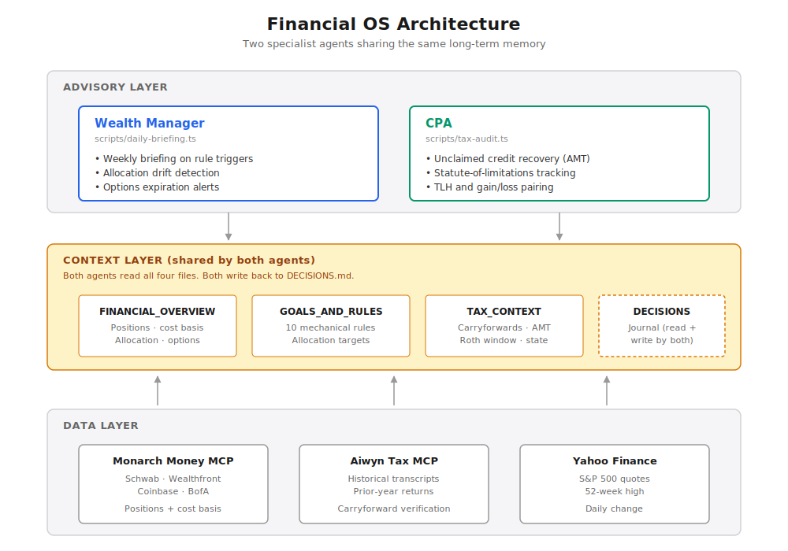

# Financial OS

Two specialist AI agents sharing the same long-term memory: a **wealth manager** that runs weekly against live brokerage positions, and a **CPA** that runs against tax documents and prior returns. Both read from the same markdown context files (goals, rules, tax situation, decision log) and write back to them. The wealth manager produces a weekly briefing with rule-driven actions and dollar amounts. The CPA ingests historical tax transcripts and surfaces unclaimed credits, amendment deadlines, and harvesting opportunities that the wealth manager then treats as deployable tax assets.

> This repo is a public, redacted version of a private system I use weekly. The architecture, code structure, and sample outputs reflect the real system; personal account details, tax data, and positions have been anonymized.

## Architecture



<details>
<summary>Text version</summary>

```
┌──────────────────────────────────────────────────────────┐
│                   Advisory Layer                          │
│  ┌─────────────────────┐    ┌─────────────────────────┐  │
│  │  Wealth Manager     │    │  CPA                    │  │
│  │  Weekly briefing    │    │  Tax audit (on demand   │  │
│  │  Rule triggers      │    │  + quarterly)           │  │
│  │  Allocation drift   │    │  Credit recovery        │  │
│  │  Options monitoring │    │  Loss harvesting        │  │
│  └─────────────────────┘    └─────────────────────────┘  │
├──────────────────────────────────────────────────────────┤
│                  Context Layer (shared)                   │
│   Persistent markdown: positions, goals, rules, tax       │
│   situation, decision history                             │
├──────────────────────────────────────────────────────────┤
│                   Data Layer                              │
│   Monarch Money MCP (Schwab, Wealthfront, Coinbase,      │
│   BofA, credit cards)                                    │
│   Aiwyn Tax MCP (transcripts, prior returns)             │
│   Yahoo Finance (S&P 500)                                │
└──────────────────────────────────────────────────────────┘
```

</details>

**Data Layer.** Monarch Money MCP provides positions, cost basis, and balances across taxable brokerage, retirement accounts, direct-indexing accounts, crypto, banking, and credit cards. Aiwyn Tax MCP ingests historical tax transcripts and prior-year returns. Yahoo Finance for S&P 500 quotes and 52-week-high tracking. TreasuryDirect and private investments are manual entries in markdown because no API exists.

**Context Layer.** Four markdown files encode everything both agents need beyond the numbers. Both agents read from these; both write back to `DECISIONS.md`:

- `FINANCIAL_OVERVIEW.md` -- portfolio snapshot, positions, cost basis, allocation vs. targets, options positions, tax assets, data-source status
- `GOALS_AND_RULES.md` -- target allocation, investment philosophy, behavioral patterns, the 10 mechanical pre-committed rules
- `TAX_CONTEXT.md` -- filing history, carryforwards, AMT credits, Roth conversion math, state tax planning
- `DECISIONS.md` -- running journal of buy/sell decisions and tax moves, reasoning, what each agent recommended, outcomes

**Advisory Layer.** Two TypeScript scripts share the same context-loading and prompt-caching plumbing:

- `scripts/daily-briefing.ts` -- the wealth manager. Reads all four context files, fetches live S&P 500 data, calls Claude with prompt caching, returns a structured weekly briefing with rule-driven actions.
- `scripts/tax-audit.ts` -- the CPA. Cross-references tax transcripts and `TAX_CONTEXT.md` against current positions and carryforwards. Surfaces unclaimed credits, statute-of-limitations deadlines, gain/loss pairing opportunities, and wash-sale risk across accounts. Output feeds back into the context layer as tax assets the wealth manager can deploy.

## What it caught

The CPA agent's first concrete result on the real system: it surfaced tens of thousands of dollars in unclaimed AMT credit from an old ISO exercise. The credit had been generated several years prior, then dropped when I switched CPAs between filings. Five subsequent returns missed it. Ingesting historical tax transcripts through Claude with the Aiwyn Tax connector caught it in one session and identified the three-year statute-of-limitations deadline for filing amended returns to recover it.

That outcome is the project's existence proof. The same context architecture that drives weekly portfolio actions also surfaces tax errors that two CPAs and a robo-advisor missed.

## What's built

- Monarch MCP integration providing live positions and cost basis across all connected accounts
- Aiwyn Tax MCP integration for ingesting historical transcripts and prior-year returns
- Weekly briefing via `npm run briefing` -- generates the wealth-manager analysis and emails it
- Tax audit via `npm run tax-audit` -- generates the CPA analysis on demand
- S&P 500 drawdown tracking against 52-week high for the mechanical rule triggers
- Full allocation calculation across all accounts with drift detection
- Tax opportunity flagging (unrealized losses, Roth conversion window, gain/loss pairing)
- Options position monitoring with expiration alerts
- Knowledge base under `/knowledge/` documenting MCP quirks so they don't have to be rediscovered every session

## What isn't built

- Any UI. Interface is the emailed briefing, or chatting with a Claude Project that has the markdown files loaded
- Direct broker MCP (community Schwab MCP exists but isn't connected here) -- would unlock lot-level cost basis for true tax-loss harvesting
- Event-triggered alerts (currently only weekly cadence on the wealth manager, manual trigger on the CPA). Should fire on 3%+ down days, T-bill maturities, and approaching statute-of-limitations deadlines
- Investment literature RAG (Bogle, Bernstein, Swensen, Malkiel)
- Coinbase MCP and direct Wealthfront automation
- Automated amendment-return drafting -- the CPA agent currently identifies opportunities but doesn't draft 1040-X forms
- Multi-user anything

## Sample output

What the wealth-manager agent produces, generated against the example context files in `/context/`. Full version in [SAMPLE_BRIEFING.md](./SAMPLE_BRIEFING.md). A sample CPA output lives alongside it in [SAMPLE_TAX_AUDIT.md](./SAMPLE_TAX_AUDIT.md).

````markdown
# Weekly Financial Briefing -- Sunday, April 26, 2026

**Top action this week:** Deploy $30K into VXUS to close the international gap.
Two rules push in this direction (Rule #4 monthly DCA floor unmet, Rule #3
T-bill maturity in 12 days). International is also the only asset class within
striking distance of the Rule #5 drift threshold.

## Portfolio Snapshot
- Total: ~$1,148K, down 0.4% from last week.
- Top movers: ACME +$3,200 on earnings, VOO +$1,800, FNRG -$1,500.

## Allocation Check
| Asset Class         | Current | Target  | Status                                    |
|---------------------|---------|---------|-------------------------------------------|
| US Equities (index) | 59%     | 50-55%  | Over by 4-9%. Within wider tolerance.     |
| International       | 13%     | 15-20%  | Under by 2-7%. Closest to Rule #5 trigger.|
| Bonds (index)       | 4%      | 5-10%   | Under by 1-6%. Not urgent.                |
| High-conviction     | 10%     | 5-10%   | At target.                                |
| Cash + T-bills      | 9%      | 5-15%   | At target.                                |

Rule #5 status: International is at 7% drift from the 17.5% midpoint. One more
month of US outperformance and this trips the 5-percentage-point threshold.

## Rule Status
- Rule #1 (10% drawdown):     NOT TRIGGERED. S&P down 5.35% from ATH.
- Rule #3 (T-bill maturity):  TRIGGERED. ~$10K maturing 5/8. Default: deploy.
- Rule #4 (Monthly DCA floor): NOT MET. No April deployment logged yet.
- Rule #10 (3%+ down day):    NOT TRIGGERED. None in last 14 sessions.

## Recommended Actions
1. Deploy $30K into VXUS. Funded by the $10K T-bill maturity on 5/8 and
   $20K from the money market. Satisfies Rule #3, Rule #4, and closes the
   international gap before Rule #5 fires.
2. Email the CPA agent's flagged AMT credit recovery (~$20K unclaimed,
   statute approaching).
3. Hold options through expiration unless ORBT moves materially.

Nothing else needs action this week.
````

## Key design decisions

**Two agents, one memory.** The wealth manager and the CPA are not separate systems with their own databases. They share the four markdown files in `/context/`. The CPA writes "AMT credit recovery available, statute approaching" into `TAX_CONTEXT.md`; the wealth manager reads it the next week and treats it as a deployable tax asset. The compounding value is in the shared context, not in either agent individually.

**Markdown as the source of truth, not a database.** Context files are human-readable, diff-able, AI-readable. No schema migrations. The user owns their data because it lives in a folder, not a SaaS account. Every other architectural choice flows from this one.

**Mechanical rules over discretion.** The behavioral failure mode this is built to fight is freezing during drawdowns. The system's job is to remove the decision surface: "Rule #1 says deploy $65K. Want to execute?" -- not to re-debate whether the rule is right. The rules live in `GOALS_AND_RULES.md`, are referenced by number, and the briefing reports each one's trigger status individually.

**Specificity over hedging.** The system prompts ban "consider" and "you might want to." If a rule triggers, the agent states the rule number and the action with a dollar amount. If nothing triggers, it says so briefly. The prompts also ban em-dashes and softening words.

**Personal first.** This is built because I needed it, not because it has a market. Whether it generalizes is a question for after it has been useful for six months.

## Cost comparison

For a portfolio in the $1-5M range with cross-account tax complexity, the alternative spend looks like:

| Service | Annual cost | What you get |
|---|---|---|
| CPA (full-service, ad hoc) | $1,500-3,000 | Tax filing + light planning. No proactive surfacing of historical errors. |
| Fee-only financial advisor (e.g. Range) | $3,000-10,000 | Cross-account planning. Advice filtered through their methodology. |
| This system | ~$5/month in API costs | Direct access to the reasoning engine. User owns the context. |

The point is not that this replaces a human CPA. It is that the marginal cost of a second opinion that has read every position and every prior return is approximately zero -- and that opinion caught a five-figure error two paid CPAs had missed across five filings.

## Tech stack

- TypeScript / Node, run via `tsx`
- Anthropic SDK (`@anthropic-ai/sdk`), Claude Sonnet with prompt caching on both the system prompt and the context block
- Monarch Money MCP (community Python server by `robcerda`, registered in `~/.claude.json`)
- Aiwyn Tax MCP for tax-document ingestion and analysis
- Yahoo Finance public chart endpoint for S&P 500
- Resend for email
- No hosting. Runs locally on a cron or manually.

## How to run it

```bash
# 1. Install dependencies
npm install

# 2. Set up environment variables
cp .env.example .env
# Fill in:
#   ANTHROPIC_API_KEY
#   RESEND_API_KEY   (optional -- script logs to stdout if missing)
#   EMAIL_TO         (optional)
#   EMAIL_FROM       (optional)

# 3. Populate the context files
# Copy the .example.md files in /context/ and remove the .example suffix.
# Replace the placeholder content with your own portfolio data, goals, and rules.

# 4. Set up the MCP servers
# Monarch: follow the setup notes in /knowledge/mcp-integrations/knowledge.md.
# Aiwyn Tax: configure per the MCP's documentation; required only for the tax-audit script.

# 5. Run the wealth manager (weekly briefing)
npm run briefing

# 6. Run the CPA (on-demand tax audit)
npm run tax-audit
```

Both scripts print to stdout and email if the Resend env vars are set.

## What I learned

> These are observations the assistant proposed from the project state. Specific to this build, not generic AI takes. Some are framed as questions where the assistant wasn't sure what I'd actually conclude.

1. **Monarch's `get_accounts.balance` is unreliable for any account that isn't a depository, credit, or feed-backed brokerage.** Crypto accounts return `null`. Manual "Other" accounts return `0` even when the UI shows a real value. The first net worth I computed from the feed was off by a large margin until I added reconciliation logic to fall back to `get_account_holdings` for crypto and to the markdown for manual accounts. The fix is documented as Rules R1-R3 in `/knowledge/mcp-integrations/rules.md`. Lesson: aggregators model the world they expect to see, and the long tail of how people actually hold money breaks that model in ways that look like the API working correctly.

2. **Prompt caching only mattered after the two-agent split.** I added `cache_control: { type: "ephemeral" }` to the system prompt and the context block thinking it would speed up weekly runs. It didn't. The ephemeral cache has a 5-minute TTL and weekly briefings always miss it, because consecutive runs are days apart. The real win came from running both scripts in sequence: the wealth manager warms the cache with the four context files, the CPA reads the same context within five minutes, and the second run's input tokens are billed at the cached rate (10% of base on Anthropic's pricing). If everything had stayed in one weekly script, I'd never have seen a cache hit. The caching infrastructure was right; the cadence wasn't.

3. **Email beat chat as the primary surface, but I'm not sure why yet.** I started assuming this would be a chat interface. The weekly email turned out to be the format I actually engage with. Hypotheses I have not validated: (a) the email arrives without me asking, which removes the activation energy of opening a chat; (b) the structured format of the briefing is easier to skim than a conversation; (c) chat invites back-and-forth that I don't always want.

4. **The mechanical-rules approach was the right constraint on AI advice, but it created a new problem: when nothing triggers, what does the system say?** The first version of the briefing tried to be helpful even when no rule fired, and the output drifted into generic commentary that I started ignoring. The current system prompt explicitly says "if nothing is triggered and no action is needed, say that briefly. Don't manufacture urgency." That single instruction made the briefings useful again. The takeaway, tentatively: rules are not just inputs to the AI; they are also a tool for telling the AI when to shut up.

5. **The two-agent split was not the original plan.** I started with one advisor that did everything. It produced briefings that tried to cover positions, allocation, taxes, and options in a single document, and the tax sections were always shallow because the output budget had to be split across all the topics. Splitting into a weekly wealth-manager run and an on-demand CPA run let each prompt go deeper on its own domain. The shared context layer was what made the split costless -- they're not duplicating memory, they're reading the same files. The unexpected benefit was that the prompts got cleaner too. The wealth-manager prompt doesn't need to know about IRS form numbers; the CPA prompt doesn't need to know about S&P drawdown rules. Specialization at the cadence level let me specialize at the prompt level, and the output from each agent became noticeably more confident.

6. **The system's biggest fragility is its dependence on me to keep `DECISIONS.md` current.** If I skip a few weeks of logging, the AI starts re-recommending things I've already decided against, because there's no record that I considered and rejected them. The same action item can show up in three consecutive briefings, each time correct given what the AI knows. The accidental mitigation: the weekly briefing itself is the forcing function. Reading the briefing prompts a "did I do anything last week I haven't logged?" check before I read the recommendations. Without that ritual, the system degrades quietly. The honest read: this only works because I'm both the user and the maintainer. A multi-tenant version of this would need a different mechanism for keeping the context fresh, and I haven't figured out what that would be.

## Why I built this

Built for myself because I had money scattered across six platforms, two CPAs who had missed a five-figure tax error, and no unified view or advisory layer. Sharing publicly as a portfolio artifact. Not actively maintained as a product. If the architecture is useful to you, fork it. If you want to talk about the design choices, the issues tab is open.
